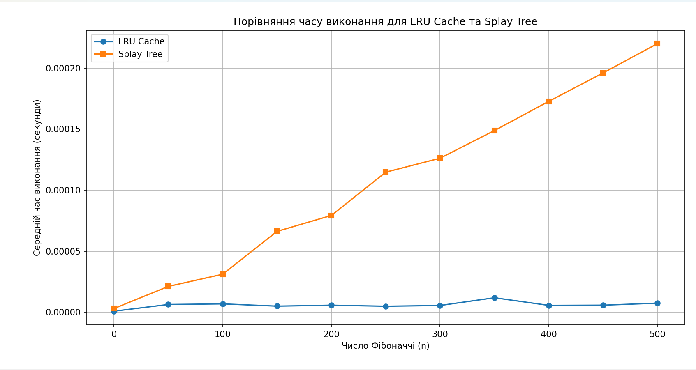

# goit-algo2-hw-07

## Графік порівняння часу виконання для LRU Cache та Splay Tree

## Таблиця, яка містить значення n, середній час виконання для LRU Cache та Splay Tree. 

n          LRU Cache Time (s)     Splay Tree Time (s)   
------------------------------------------------------
0          0.0000009000           0.0000030800
50         0.0000064000           0.0000212000
100        0.0000069000           0.0000311800
150        0.0000050400           0.0000662800
200        0.0000058000           0.0000793000
250        0.0000049600           0.0001147400
300        0.0000055800           0.0001261800
350        0.0000119200           0.0001488200
400        0.0000056600           0.0001727600
450        0.0000058200           0.0001960400
500        0.0000075000           0.0002200400

# Висновки
## На основі отриманої таблиці часу виконання для обчислення чисел Фібоначчі можна зробити такі висновки щодо ефективності підходів LRU Cache та Splay Tree:

1. LRU Cache значно швидший
- Час виконання для fibonacci_lru(n) залишається стабільно низьким (~5–7 мікросекунд), навіть при великих n (до 500).
- Це пов’язано з тим, що @lru_cache реалізовано на рівні CPython і дуже ефективно працює з мемоізацією рекурсивних викликів.

2. Splay Tree суттєво повільніший
- Час зростає приблизно лінійно із збільшенням n.\
Наприклад:
  * при n = 50: ≈ 21 μs
  * при n = 250: ≈ 112 μs
  * при n = 500: ≈ 220 μs\
Це пояснюється тим, що вставка і пошук у дереві вимагають додаткових операцій ротації (splay), навіть якщо значення вже було обчислено.

## Загальний висновок:
- Якщо потрібна максимальна швидкодія — LRU Cache є безумовно кращим вибором.
- Splay Tree — гнучкіша структура, яка корисна тоді, коли:
  * ключі нечислові або складні;
  * потрібно динамічно змінювати кеш;
  * важливий сам механізм "часто використовувані ближче до кореня".
- Для обчислення чисел Фібоначчі Splay Tree програє по продуктивності.

